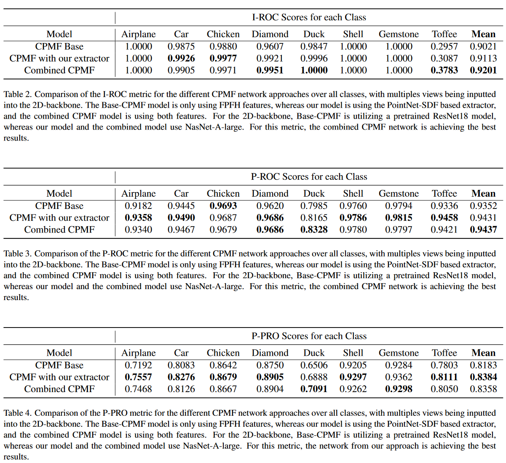

# Enhanced:  Complementary Pseudo Multimodal Feature for Point Cloud Anomaly Detection as a project work in Machine Learning for 3D Geometry [(TUM WS23/24)]()
### [Base Paper:](https://arxiv.org/abs/2303.13194)
Base paper rankings as of 2024-02-07

[](https://paperswithcode.com/sota/depth-anomaly-detection-and-segmentation-on?p=complementary-pseudo-multimodal-feature-for)

[](https://paperswithcode.com/sota/3d-anomaly-detection-and-segmentation-on?p=complementary-pseudo-multimodal-feature-for)


## Introduction
We are a team of four pursuing our Master of Science at the Technical University of Munich. This project work involved choosing a recently published research in domain of 3D anomaly detection. Hence, we took up the base CPMF paper, and added a few modifications to its pipeline. Some of the modifications have  been inspired by [Shape-Guided](https://openreview.net/pdf?id=IkSGn9fcPz) and [Neural-Pull](https://arxiv.org/pdf/2011.13495.pdf).


## Base CPMF
Notable steps in the base CPMF point cloud anomaly detections follows:
1. The high-resolution point cloud is downsampled to 224 × 224 × 3 to match the resolution of the multi-view images.

2. The downsampled point cloud is utilized to generate twenty-seven multi-view images of 224 × 224 resolution. A visualization example can be seen in Figure 2 in our report.

3. These multi-view images are then processed through a pretrained ResNet network, which outputs a complementary feature vector for every point in the downsampled point cloud.

4. FPFH is applied to the downsampled point cloud for 3D feature extraction, representing a non-deep learning-based feature descriptor.

5. The feature vectors from the previous steps are aggregated, providing each point with an RGB feature map and a 3D feature vector.

6. During training, CPMF features for good samples are stored in a memory bank, which is then queried with abnormal samples during testing to generate the final score.


## Enhancements to the Base CPMF Network

Below, we detail the significant enhancements introduced to the base CPMF network:
1. Introduction of PointNet and PointNet++ for preliminary 3D modality feature extraction, marking a shift towards deep learning techniques.
2. Deployment of a super-resolution Signed Distance Field (SDF) Network to refine the extraction of 3D features, enhancing the network’s spatial understanding.

3. Integration of a noising and patching process, devised to enrich the learning of local geometries within high-resolution point clouds.

4. Reworking of the final feature aggregation module, enabling a three-stage rich feature fusion.

5. Substitution of the pretrained ResNet 2D backbone with NasNet, selected for its superior performance in anomaly detection contexts.

For more details regarding the implementation, here is our [report]().
## Cloning & Setup

1.  Clone our GitHub repo:
```bash
git https://github.com/MalazTamim/3D-Anomaly-Detection
cd 3D-Anomaly-Detection/CPMF
```

2. Create a new conda environment to install the required libraries:
```bash
conda create -n 3d_Ecpmf python=3.7
conda activate 3d_Ecpmf
sh init.sh
```

3. Download the [RealAD-3D dataset](https://github.com/M-3LAB/Real3D-AD), RealAD-3D Multiview Dataset(generated from the pipeline here) and the pretrained checkpoints:
```bash
RealAD dataset : https://drive.google.com/file/d/1S3ul2qNNSiV_JZmhPj_-U0ZbO2TdVN30/view?usp=sharing
RealAD-3D Multiview Dataset : https://drive.google.com/file/d/10SbU9AKNQQyIlT5Q0MkvRaUlhvxHpiry/view?usp=sharing
Pretrained Checkpoints : https://drive.google.com/file/d/1FTcZnUkwrL8H--xBFQY2z3esVCuwR_ZX/view?usp=sharing
```
Note: [RealAD-3D dataset](https://github.com/M-3LAB/Real3D-AD) needed extensive preprocessing for the current pipeline, the details can be seen in  [report]().

4. Extract the downloaded dataset, Multiview dataset and checkpoints in such file structure:
```bash
--3D-Anomaly-Detection/CPMF/

        -datasets/Real_AD_3D

        -datasets/Real_AD_3D_multi_view

        -checkpoint_pointnet/

        .
        .
        .

        - run_main.sh
```


## Preprocessing & Multiview Generation
If you downloaded the multi_view dataset in the last step already, skip this step, this step only needs to be done once.

1. Running the Preprocessing for all the available classes:
```bash
sh preprocess_dataset.sh
```

## Training
If you downloaded the pretrained model checkpoints in the cloning & setup step, skip this step.

1. Training the Pointnet & SDF Network for every class:
```bash
sh run_train.sh
```

The training arguments are in train.py if you feel to change them.


## Inference
This will build the memory bank in the first stage, and would then go on to detect 3D pointcloud anomalies.

1. Inference with the Pointnet & SDF Network for every class:
```bash
sh run_main.sh.sh
```

Note : 
- Large amount of CPU RAM is required to run this step with the default 2D backbone, switch to ResNet if low on memory. Furthermore, Linux users can create a SWAP file to increase the CPU memory.
- Metrics would be stored by default in results/csv/deafult.csv


## Results

        

## Team
This project work spanned over five weeks in a team of four:

Malaz Tamim : M.Sc. Data Engineering and Analytics

Abhinav Utkarsh : M.Sc. Robotics, Cognition, Intelligence

Matthias Pouleau : M.Sc. Robotics, Cognition, Intelligence

Sayak Dutta : M.Sc. Robotics, Cognition, Intelligence